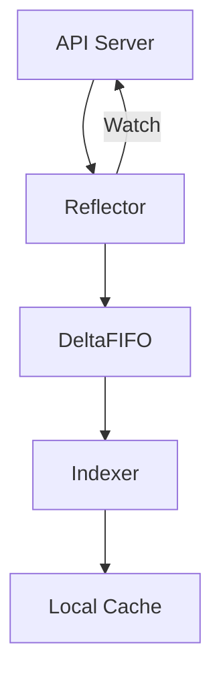

# K8S operator

Created: 2025年1月27日 19:38
Status: 完成

# client-go架构


# RESTClient


```markdown
# Kubernetes RESTClient 使用分析文档

## 代码位置
文件: `04/main.go`

## RESTClient 相关代码
```go
// RESTClient 配置部分
config, err := clientcmd.BuildConfigFromFlags("", clientcmd.RecommendedHomeFile)
if err != nil {
    panic(err)
}
config.GroupVersion =  &v1.SchemeGroupVersion
config.NegotiatedSerializer = scheme.Codecs
config.APIPath = "/api"

// 创建 RESTClient
restClient, err := rest.RESTClientFor(config)
if err != nil {
    panic(err)
}

// 使用 RESTClient 获取数据
pod := v1.Pod{}
err = restClient.Get().
    Namespace("default").
    Resource("pods").
    Name("test").
    Do(context.TODO()).
    Into(&pod)

```

### 1. 配置初始化

- 使用 `clientcmd.BuildConfigFromFlags()` 创建基础配置
- 配置关键参数:
    - `GroupVersion`: 设置API组和版本
    - `NegotiatedSerializer`: 设置序列化器
    - `APIPath`: 设置API路径为 "/api"

### 2. RESTClient 创建

- 使用 `rest.RESTClientFor()` 基于配置创建RESTClient实例
- 错误处理确保客户端创建成功

### 3. 数据请求

- 使用链式调用方式构建请求
- 请求组成部分:
    - `Get()`: 指定HTTP方法
    - `Namespace()`: 指定命名空间
    - `Resource()`: 指定资源类型
    - `Name()`: 指定资源名称
    - `Do()`: 执行请求
    - `Into()`: 将结果解析到目标结构体

### **RESTClient 的核心原理**

### 1. **设计目标**

- **标准化请求**：封装 Kubernetes API 的 RESTful 规范（如资源路径 `/api/v1/namespaces/{namespace}/pods`）。
- **认证与传输**：自动处理 TLS 证书、Token 认证、HTTP 连接池等底层细节。
- **序列化与反序列化**：将 Go 结构体与 API 的 JSON/YAML 格式双向转换（基于 `k8s.io/apimachinery` 的编解码器）。

### 2. **核心组件**

- **RESTClient 接口**：定义 `Get()`, `Post()`, `Put()`, `Delete()` 等 HTTP 方法。
- **Request 对象**：构建请求的链式调用（如设置路径参数、查询参数、请求体）。
- **ClientConfig**：存储集群连接配置（如 API Server 地址、认证信息、TLS 配置）。

### 3. **与其他客户端的关系**

| **客户端类型** | **特点** |
| --- | --- |
| **RESTClient** | 最底层客户端，直接操作原始 API，无资源类型校验。 |
| **ClientSet** | 基于生成的代码，提供强类型资源操作（如 `corev1.Pod`）。 |
| **DynamicClient** | 动态客户端，操作非结构化数据（`unstructured.Unstructured`）。 |
| **DiscoveryClient** | 用于发现 API Server 支持的资源类型和版本。 |

---

### **三、RESTClient 的使用步骤**

### 1. **创建 RESTClient 实例**

需从 `kubeconfig` 文件或集群内 ServiceAccount 加载配置：

go

:

```
import (
    "k8s.io/client-go/rest"
    "k8s.io/client-go/tools/clientcmd"
)

// 从 kubeconfig 文件加载配置
config, err := clientcmd.BuildConfigFromFlags("", "/path/to/kubeconfig")
if err != nil {
    panic(err)
}

// 创建 RESTClient 实例
restClient, err := rest.RESTClientFor(config)
if err != nil {
    panic(err)
}
```

### 2. **构建请求并发送**

以查询默认命名空间下的 Pod 列表为例：

go

:

```
import (
    metav1 "k8s.io/apimachinery/pkg/apis/meta/v1"
    corev1 "k8s.io/api/core/v1"
)

// 定义返回结果的结构体
var podList corev1.PodList

// 构建 GET 请求
err := restClient.Get().
    Namespace("default").          // 设置命名空间
    Resource("pods").             // 资源类型（复数形式）
    VersionedParams(&metav1.ListOptions{Limit: 100}, metav1.ParameterCodec). // 查询参数
    Do(context.TODO()).           // 发送请求
    Into(&podList)                // 将结果反序列化到 podList
if err != nil {
    panic(err)
}

// 遍历 Pod 列表
for _, pod := range podList.Items {
    fmt.Printf("Pod Name: %s\n", pod.Name)
}
```

### 3. **常见操作示例**

- **创建 Pod**：
    
    go
    
    :
    
    ```
    pod := &corev1.Pod{
        ObjectMeta: metav1.ObjectMeta{Name: "nginx"},
        Spec: corev1.PodSpec{
            Containers: []corev1.Container{
                {Name: "nginx", Image: "nginx:alpine"},
            },
        },
    }
    
    err := restClient.Post().
        Namespace("default").
        Resource("pods").
        Body(pod).                  // 请求体
        Do(context.TODO()).
        Error()
    ```
    
- **删除 Pod**：
    
    go
    
    :
    
    ```
    err := restClient.Delete().
        Namespace("default").
        Resource("pods").
        Name("nginx").              // 资源名称
        Do(context.TODO()).
        Error()
    ```
    
- **更新 Pod**：
    
    go
    
    :
    
    ```
    updatedPod := pod.DeepCopy()
    updatedPod.Labels["env"] = "prod"
    
    err := restClient.Put().
        Namespace("default").
        Resource("pods").
        Name("nginx").
        Body(updatedPod).
        Do(context.TODO()).
        Error()
    ```
    

---

### **四、RESTClient 的高级功能**

### 1. **自定义请求参数**

- **路径参数**：通过 `SubResource()` 访问子资源（如 `/status`）：
    
    go
    
    :
    
    ```
    restClient.Get().
        Namespace("default").
        Resource("pods").
        Name("nginx").
        SubResource("status").
        Do(context.TODO())
    ```
    
- **查询参数**：通过 `Param()` 设置 URL 参数：
    
    go
    
    :
    
    ```
    restClient.Get().
        Param("labelSelector", "app=nginx").
        Param("timeoutSeconds", "30")
    ```
    

## ClientSet使用

```markdown
# Kubernetes ClientSet 使用分析文档

## 代码位置
文件: `04/main.go`

## ClientSet 相关代码
```go
// 配置初始化
config, err := clientcmd.BuildConfigFromFlags("", clientcmd.RecommendedHomeFile)
if err != nil {
    panic(err)
}

// 创建 ClientSet
clientset, err := kubernetes.NewForConfig(config)
if err != nil {
    panic(err)
}

// 获取 CoreV1 客户端
coreV1 := clientset.CoreV1()

// 使用客户端访问资源
pod, err := coreV1.Pods("default").Get(context.TODO(), "test", v1.GetOptions{})

```

## 详细分析

### 1. 配置创建

- 使用 `clientcmd.BuildConfigFromFlags` 创建配置
    - 第一个参数: master URL，空字符串表示使用默认值
    - 第二个参数: kubeconfig 文件路径，使用默认路径 (~/.kube/config)
- 配置包含了访问集群所需的所有信息：
    - 集群地址
    - 认证信息
    - 上下文信息

### 2. ClientSet 创建

- 使用 `kubernetes.NewForConfig()` 创建 ClientSet
- ClientSet 是多个客户端的集合，包括：
    - CoreV1()
    - AppsV1()
    - BatchV1()
    - 等其他 API 组的客户端

### 3. 资源访问

- 通过 API 组客户端访问具体资源
- 示例中使用了 CoreV1 访问 Pod 资源
- 访问方式：
    
    ```go
    客户端.资源类型(复数形式).操作方法()
    
    ```
    

## 常用操作示例

### 1. Pod 操作

```go
// 获取 Pod
pod, err := clientset.CoreV1().Pods(namespace).Get(context.TODO(), podName, v1.GetOptions{})

// 列出 Pod
pods, err := clientset.CoreV1().Pods(namespace).List(context.TODO(), v1.ListOptions{})

// 创建 Pod
newPod, err := clientset.CoreV1().Pods(namespace).Create(context.TODO(), podObj, v1.CreateOptions{})

// 删除 Pod
err := clientset.CoreV1().Pods(namespace).Delete(context.TODO(), podName, v1.DeleteOptions{})

```

### 2. 其他资源操作

```go
// Deployment 操作
deployment, err := clientset.AppsV1().Deployments(namespace).Get(context.TODO(), name, v1.GetOptions{})

// Service 操作
service, err := clientset.CoreV1().Services(namespace).Get(context.TODO(), name, v1.GetOptions{})

// ConfigMap 操作
configMap, err := clientset.CoreV1().ConfigMaps(namespace).Get(context.TODO(), name, v1.GetOptions{})

```

## ClientSet 优势

1. 类型安全
    - 提供类型化的方法调用
    - 编译时可以发现类型错误
2. 使用简单
    - API 接口清晰直观
    - 方法命名符合直觉
3. 功能完整
    - 支持所有标准 Kubernetes 资源
    - 自动处理序列化/反序列化
4. 版本化支持
    - 不同 API 版本有独立的客户端
    - 便于处理版本兼容性

### 注意事项

1. 权限控制
    - ClientSet 使用 kubeconfig 中的权限
    - 确保有足够的操作权限
2. 资源限制
    - 注意 API 请求的频率限制
    - 合理使用 List 操作的分页功能
3. 版本兼容
    - 确保 ClientSet 版本与集群版本兼容
    - 注意 API 版本的废弃警告

### 总结

1. ClientSet 是最常用的 Kubernetes 客户端
2. 提供类型安全和简单易用的 API
3. 支持所有标准 Kubernetes 资源操作
4. 适合大多数常规的 Kubernetes 操作场景

Informer原理详解

## Informer基本概念

Informer是Kubernetes中的一个核心机制，用于监视(Watch)和缓存(Cache)Kubernetes API对象。它能够减少对API Server的直接请求，提供更好的性能和可扩展性。

### Informer 的核心概念与实现机制

### 1. **Informer 的定义与核心作用**

Informer 是 Kubernetes 中用于**高效监控资源状态变化**的核心机制。它通过封装 `List-Watch` 模式，实现与 Kubernetes API Server 的实时通信，确保客户端（如 Controller）能够及时感知资源的增删改事件，同时维护本地缓存以降低对 API Server 的直接访问压力148。

### 2. **Informer 的核心组件**

- **Reflector**：负责从 API Server 拉取全量资源（`List`）并持续监听增量事件（`Watch`），将事件转换为 `Delta`（操作类型+资源对象）存入 `DeltaFIFO` 队列48。
- **DeltaFIFO**：先进先出的增量队列，存储资源对象及其操作类型（如 `Added`、`Updated`、`Deleted`），支持去重和批量处理16。
- **Indexer**：本地缓存存储，基于键值对和索引（如命名空间索引）快速查询资源对象，减少对 API Server 的依赖84。
- **Controller**：协调 Reflector 和 DeltaFIFO，驱动事件处理循环（`processLoop`），调用注册的事件处理器（如 `AddFunc`、`UpdateFunc`）68。

### 3. **Informer 的工作流程**

1. **初始化阶段**：通过 `List` 获取资源全量数据，初始化本地缓存（Indexer）48。
2. **事件监听**：通过 `Watch` 监听 API Server 的资源变更事件，将事件转换为 `Delta` 推入 DeltaFIFO16。
3. **事件处理**：从 DeltaFIFO 弹出事件，更新 Indexer 并触发用户注册的回调函数（如将事件推入 WorkQueue 供 Controller 处理）48。
4. **缓存同步**：周期性执行 `Resync`，强制刷新本地缓存以确保数据一致性68。

### 4. **SharedInformer 的共享机制**

SharedInformer 是 Informer 的共享实现，**同一类资源的多个监听器共享一个 Reflector**，避免重复的 `List-Watch` 操作，显著降低 API Server 负载。例如，多个 Controller 监听 Pod 资源时，共享同一个 Informer 实例18。

---

### ShardingInformer 的设计与场景

### 1. **ShardingInformer 的概念**

ShardingInformer 是 **Informer 的分片扩展**，用于应对大规模集群中资源数量庞大或监听范围分散的场景。通过将资源按分片（Shard）划分，每个分片由独立的 Informer 处理，从而提升横向扩展能力和事件处理效率110。

### 2. **核心设计原理**

- **分片策略**：按资源标签、命名空间或其他属性划分分片（例如按命名空间分片监听不同的 Pod 子集）10。
- **并行处理**：每个分片对应独立的 Informer 实例，并行处理事件，减少单实例的负载压力110。
- **动态调整**：支持动态增减分片，适应集群规模变化（如自动扩缩容）10。

### 3. **典型应用场景**

- **超大规模集群**：当单 Informer 处理所有资源事件导致性能瓶颈时，分片可分散负载10。
- **多租户隔离**：为不同租户分配独立分片，实现资源监控的物理或逻辑隔离10。
- **混合云环境**：跨多个 Kubernetes 集群的分片监听，统一事件处理框架10。

### 4. **实现示例**

在代码中，`SharedInformerFactory` 已隐含分片思想，通过工厂模式管理多类资源的 Informer。若需显式分片，可通过自定义分片逻辑初始化多个 Informer，例如：

go

:

```
// 按命名空间分片
shardInformers := make([]cache.SharedIndexInformer, numShards)
for i := 0; i < numShards; i++ {
    shardInformers[i] = informers.NewFilteredPodInformer(client, namespaceSelector(i), resyncPeriod, indexers, tweakListOptions)
}
```

---

### 总结对比

| **特性** | **Informer** | **ShardingInformer** |
| --- | --- | --- |
| **核心目标** | 高效监控单一资源类型 | 分片处理大规模资源或跨范围监听 |
| **资源消耗** | 单实例负载较高 | 分片分散负载，提升扩展性 |
| **适用场景** | 中小规模集群、单一资源类型 | 超大规模集群、多租户隔离、混合云环境 |
| **实现复杂度** | 简单，直接使用 SharedInformerFactory | 需自定义分片策略和事件路由逻辑 |

## 核心组件

### 1. Informer的主要组件

```go
type SharedInformer interface {
    // 添加事件处理器
    AddEventHandler(handler ResourceEventHandler)
    // 添加带过滤器的事件处理器
    AddEventHandlerWithResyncPeriod(handler ResourceEventHandler, resyncPeriod time.Duration)
    // 启动Informer
    Run(stopCh <-chan struct{})
    // 是否已同步完成
    HasSynced() bool
    // 获取Store
    GetStore() Store
    // 获取Controller
    GetController() Controller
}

```

### 2. 核心工作流程



### 3. 主要组件说明

### Reflector

```go
// Reflector主要职责
type Reflector struct {
    // 存储资源类型
    expectedType reflect.Type
    // Store接口
    store Store
    // List/Watch的资源类型
    listerWatcher ListerWatcher
    // 重新同步周期
    resyncPeriod time.Duration
}

```

主要功能：

- 通过ListAndWatch机制从API Server获取资源对象
- 将变更事件放入DeltaFIFO队列

### DeltaFIFO

```go
// DeltaFIFO队列
type DeltaFIFO struct {
    // 存储对象的队列
    items map[string]Deltas
    // 队列
    queue []string
    // 资源键的生成函数
    keyFunc KeyFunc
}

```

主要功能：

- 存储资源对象的变更事件
- 确保事件按顺序处理
- 去重和压缩事件

### Indexer

```go
// Indexer接口
type Indexer interface {
    Store
    // 索引相关操作
    Index(indexName string, obj interface{}) ([]interface{}, error)
    IndexKeys(indexName, indexKey string) ([]string, error)
    ListIndexFuncValues(indexName string) []string
    ByIndex(indexName, indexKey string) ([]interface{}, error)
}

```

主要功能：

- 提供本地缓存
- 支持索引功能
- 提供快速查询能力

## 工作原理详解

### 1. 初始化流程

```go
// 创建Informer示例
informer := cache.NewSharedInformer(
    &cache.ListWatch{
        ListFunc: func(options metav1.ListOptions) (runtime.Object, error) {
            return kubeClient.CoreV1().Pods(namespace).List(context.TODO(), options)
        },
        WatchFunc: func(options metav1.ListOptions) (watch.Interface, error) {
            return kubeClient.CoreV1().Pods(namespace).Watch(context.TODO(), options)
        },
    },
    &v1.Pod{},
    resyncPeriod,
)

```

### 2. 事件处理流程

1. List阶段：
- 首次启动时，Reflector通过ListFunc获取资源对象的完整列表
- 将所有对象添加到DeltaFIFO队列
1. Watch阶段：
- Reflector通过WatchFunc监听资源变更
- 将ADD/UPDATE/DELETE事件放入DeltaFIFO队列
1. 本地缓存：
- Indexer维护本地缓存
- 支持按照不同索引快速查询

### 3. 重要特性

### Resync机制

```go
// Resync周期设置
func NewSharedInformer(lw ListerWatcher, objType runtime.Object, resyncPeriod time.Duration) SharedInformer {
    return NewSharedIndexInformer(lw, objType, resyncPeriod, Indexers{})
}

```

- 定期将本地缓存中的对象重新同步
- 确保数据一致性
- 可以触发周期性的更新事件

### 事件处理器

```go
// 添加事件处理器
informer.AddEventHandler(cache.ResourceEventHandlerFuncs{
    AddFunc: func(obj interface{}) {
        // 处理添加事件
    },
    UpdateFunc: func(oldObj, newObj interface{}) {
        // 处理更新事件
    },
    DeleteFunc: func(obj interface{}) {
        // 处理删除事件
    },
})

```

## 最佳实践

1. 合理使用SharedInformer
- 同一类资源共享一个Informer实例
- 避免重复Watch相同资源
1. 正确处理事件
- 在事件处理器中避免耗时操作
- 使用工作队列异步处理事件
1. 设置合适的Resync周期
- 根据业务需求设置合理的重新同步周期
- 避免过于频繁的重新同步

## 总结

Informer机制是Kubernetes客户端编程中的重要组件，它通过本地缓存和事件处理机制，大大减少了对API Server的访问压力，提供了高效的资源监控和事件处理能力。理解Informer的工作原理对于开发Kubernetes控制器和操作符至关重要。

# **SharedInformer原理**


SharedInformer是Kubernetes中一个重要的共享机制，用于在多个控制器之间共享相同资源的监听和缓存。

## 核心原理

### 1. 基本结构

```go
type sharedInformer struct {
    // 资源类型信息
    informer *Informer

    // 共享的处理器
    processors *sharedProcessor

    // 缓存
    cache *threadSafeStore

    // 控制器
    controller *Controller

    // 重新同步周期
    resyncPeriod time.Duration
}

```

### 2. 主要组件

### sharedProcessor

```go
type sharedProcessor struct {
    // 监听器列表
    listeners []*processorListener

    // 同步锁
    lock sync.RWMutex

    // 是否正在运行
    running bool
}

```

主要功能：

- 管理多个事件处理器
- 分发事件到所有注册的处理器
- 确保线程安全

### processorListener

```go
type processorListener struct {
    // 事件处理器接口
    handler ResourceEventHandler

    // 重新同步周期
    resyncPeriod time.Duration

    // 下一次重新同步时间
    nextResync time.Time

    // 事件队列
    addCh  chan interface{}
    updateCh chan interface{}
    deleteCh chan interface{}
}

```

### 3. 工作流程

### 初始化流程

```go
// 创建SharedInformer
sharedInformer := NewSharedInformer(
    &cache.ListWatch{
        ListFunc: listFunc,
        WatchFunc: watchFunc,
    },
    &v1.Pod{},
    time.Minute*30,
)

// 添加事件处理器
sharedInformer.AddEventHandler(cache.ResourceEventHandlerFuncs{
    AddFunc: func(obj interface{}) {
        // 处理添加事件
    },
    UpdateFunc: func(old, new interface{}) {
        // 处理更新事件
    },
    DeleteFunc: func(obj interface{}) {
        // 处理删除事件
    },
})

```

### 事件分发流程

1. 接收事件：

```go
func (p *sharedProcessor) distribute(obj interface{}, sync bool) {
    p.lock.RLock()
    defer p.lock.RUnlock()

    // 分发给所有监听器
    for _, listener := range p.listeners {
        listener.add(obj)
    }
}

```

1. 处理器处理：

```go
func (p *processorListener) run() {
    // 处理添加事件
    for {
        select {
        case obj := <-p.addCh:
            p.handler.OnAdd(obj)
        case obj := <-p.updateCh:
            p.handler.OnUpdate(obj)
        case obj := <-p.deleteCh:
            p.handler.OnDelete(obj)
        }
    }
}

```

### 4. 重要特性

### 共享机制

```go
// 多个控制器共享同一个Informer
podInformer := factory.Core().V1().Pods()

controller1.AddEventHandler(...)
controller2.AddEventHandler(...)
controller3.AddEventHandler(...)

```

优点：

- 减少对API Server的请求
- 共享内存缓存
- 降低系统资源消耗

### 线程安全

```go
// 线程安全的Store实现
type threadSafeStore struct {
    lock  sync.RWMutex
    items map[string]interface{}
}

```

特性：

- 并发安全的读写操作
- 原子性的缓存更新
- 避免数据竞争

## 最佳实践

### 1. 合理使用SharedInformer

```go
// 推荐：使用InformerFactory
informerFactory := informers.NewSharedInformerFactory(client, time.Hour)
podInformer := informerFactory.Core().V1().Pods()

// 不推荐：直接创建多个Informer
informer1 := cache.NewSharedInformer(...)
informer2 := cache.NewSharedInformer(...)

```

### 2. 事件处理优化

```go
// 推荐：使用工作队列
type Controller struct {
    queue workqueue.RateLimitingInterface
    informer cache.SharedInformer
}

// 添加事件处理器
informer.AddEventHandler(cache.ResourceEventHandlerFuncs{
    AddFunc: func(obj interface{}) {
        key, err := cache.MetaNamespaceKeyFunc(obj)
        if err == nil {
            queue.Add(key)
        }
    },
})

```

### 3. 资源管理

```go
// 正确关闭资源
stopCh := make(chan struct{})
defer close(stopCh)

go informerFactory.Start(stopCh)
go controller.Run(stopCh)

```

## 优势与注意事项

### 优势

1. 资源效率
- 减少API Server负载
- 优化内存使用
- 提高系统性能
1. 开发效率
- 简化事件处理逻辑
- 统一的缓存访问接口
- 标准化的事件处理模式

### 注意事项

1. 内存管理
- 合理设置缓存大小
- 及时清理无用的监听器
- 避免内存泄漏
1. 错误处理
- 妥善处理事件处理器的错误
- 实现重试机制
- 记录关键日志

# Reflector原理


经过检查提供的文件，我发现在 04/main.go 和 04/go.sum 中并没有直接使用 Reflector 的相关代码。为了准确描述 Reflector 和 RESTClient 的关系，我将基于 client-go 的源码进行分析：

```markdown
# Kubernetes Reflector 与 RESTClient 关系分析

## Reflector 概述

Reflector 位于 `k8s.io/client-go/tools/cache` 包中，是一个核心组件，负责监视特定类型 Kubernetes API 对象的变化。

### 核心源码结构

```go
// k8s.io/client-go/tools/cache/reflector.go

type Reflector struct {
    // name 标识这个 reflector 的名称
    name string

    // 期望观察的类型
    expectedType reflect.Type

    // 存储接口，用于存储观察到的对象
    store Store

    // ListerWatcher 接口，用于列举和监视资源
    listerWatcher ListerWatcher

    // 上一次同步的资源版本
    lastSyncResourceVersion string

    // ... 其他字段
}

```

### 与 RESTClient 的关系

1. **通过 ListerWatcher 接口连接**

```go
// k8s.io/client-go/tools/cache/listwatch.go

type ListerWatcher interface {
    List(options metav1.ListOptions) (runtime.Object, error)
    Watch(options metav1.ListOptions) (watch.Interface, error)
}

```

1. **实际实现示例**

```go
// 创建 ListWatch
lw := &cache.ListWatch{
    ListFunc: func(options metav1.ListOptions) (runtime.Object, error) {
        return client.CoreV1().Pods(namespace).List(context.TODO(), options)
    },
    WatchFunc: func(options metav1.ListOptions) (watch.Interface, error) {
        return client.CoreV1().Pods(namespace).Watch(context.TODO(), options)
    },
}

```

## 工作流程

1. **初始化流程**

```go
func NewReflector(lw ListerWatcher, expectedType interface{}, store Store, resyncPeriod time.Duration) *Reflector {
    return &Reflector{
        name:          name,
        listerWatcher: lw,
        store:        store,
        expectedType: expectedType,
        period:      period,
        // ...
    }
}

```

1. **List-Watch 机制**

```go
// k8s.io/client-go/tools/cache/reflector.go

func (r *Reflector) ListAndWatch(stopCh <-chan struct{}) error {
    // 1. 首先执行 List 操作
    list, err := r.listerWatcher.List(options)

    // 2. 存储对象
    if err := r.store.Replace(items, resourceVersion); err != nil {
        return fmt.Errorf("unable to sync list result: %v", err)
    }

    // 3. 开始 Watch 操作
    for {
        w, err := r.listerWatcher.Watch(options)
        if err != nil {
            // 处理错误...
        }
        if err := r.watchHandler(w, &resourceVersion, ...); err != nil {
            // 处理错误...
        }
    }
}

```

## 关键功能实现

### 1. 数据同步

```go
func (r *Reflector) watchHandler(w watch.Interface, resourceVersion *string, ...) error {
    for {
        select {
        case event, ok := <-w.ResultChan():
            // 处理 watch 事件
            switch event.Type {
            case watch.Added:
                r.store.Add(event.Object)
            case watch.Modified:
                r.store.Update(event.Object)
            case watch.Deleted:
                r.store.Delete(event.Object)
            }
        }
    }
}

```

### 2. 重新同步机制

```go
func (r *Reflector) Run(stopCh <-chan struct{}) {
    wait.Until(func() {
        if err := r.ListAndWatch(stopCh); err != nil {
            // 处理错误...
        }
    }, r.period, stopCh)
}

```

## Reflector 与 RESTClient 交互图

```
┌──────────────┐    List/Watch    ┌──────────────┐    HTTP    ┌─────────────┐
│   Reflector  │ ───────────────> │  RESTClient  │ ─────────> │ Kubernetes  │
└──────────────┘                  └──────────────┘            │     API     │
       │                                                      └─────────────┘
       │                                                            │
       │              Watch Events                                  │
       └────────────────────────────────────────────────────────────┘

```

## 主要用途

1. **缓存同步**
    - 维护本地缓存与 API Server 的数据同步
    - 减少对 API Server 的直接访问
2. **事件处理**
    - 处理资源的增删改事件
    - 触发相应的回调函数
3. **资源监控**
    - 持续监控特定资源的变化
    - 支持断线重连和重试机制

## 注意事项

1. **资源版本管理**
    - 需要正确处理 resourceVersion
    - 确保数据一致性
2. **错误处理**
    - 需要处理网络错误
    - 实现适当的重试机制
3. **性能考虑**
    - 合理设置重新同步周期
    - 避免过多的 Watch 连接

# DeltaFIFO 原理


```markdown
# Kubernetes DeltaFIFO 原理分析

## 源码位置
DeltaFIFO 的源码位于 k8s.io/client-go/tools/cache/delta_fifo.go

## 核心数据结构

```go
// DeltaFIFO 主要结构
type DeltaFIFO struct {
    // 继承自 FIFO 队列
    queue []interface{}

    // 存储对象的 map
    items map[string]Deltas

    // 资源键生成器
    keyFunc KeyFunc

    // 数据存储接口
    knownObjects KeyListerGetter

    // 条件变量，用于同步
    cond sync.Cond
}

// Delta 表示一个变更
type Delta struct {
    Type   DeltaType       // 变更类型
    Object interface{}     // 变更对象
}

// Deltas 是按时间顺序排列的变更列表
type Deltas []Delta

// DeltaType 表示变更类型
type DeltaType string

const (
    Added   DeltaType = "Added"    // 添加
    Updated DeltaType = "Updated"  // 更新
    Deleted DeltaType = "Deleted"  // 删除
    Sync    DeltaType = "Sync"    // 同步
)

```

## 主要功能实现

### 1. 添加对象

```go
func (f *DeltaFIFO) Add(obj interface{}) error {
    key, err := f.KeyOf(obj)
    if err != nil {
        return KeyError{obj, err}
    }

    f.lock.Lock()
    defer f.lock.Unlock()

    // 添加到 items
    f.addIfNotPresent(key, obj, Added)
    return nil
}

```

### 2. 更新对象

```go
func (f *DeltaFIFO) Update(obj interface{}) error {
    key, err := f.KeyOf(obj)
    if err != nil {
        return KeyError{obj, err}
    }

    f.lock.Lock()
    defer f.lock.Unlock()

    // 添加更新事件
    f.addIfNotPresent(key, obj, Updated)
    return nil
}

```

### 3. 删除对象

```go
func (f *DeltaFIFO) Delete(obj interface{}) error {
    key, err := f.KeyOf(obj)
    if err != nil {
        return KeyError{obj, err}
    }

    f.lock.Lock()
    defer f.lock.Unlock()

    // 添加删除事件
    f.addIfNotPresent(key, obj, Deleted)
    return nil
}

```

### 4. 消费队列

```go
func (f *DeltaFIFO) Pop(process PopProcessFunc) (interface{}, error) {
    f.lock.Lock()
    defer f.lock.Unlock()

    for {
        // 等待队列非空
        for len(f.queue) == 0 {
            f.cond.Wait()
        }

        // 获取并处理第一个元素
        id := f.queue[0]
        f.queue = f.queue[1:]
        item, ok := f.items[id]
        if !ok {
            continue
        }

        // 处理对象
        err := process(item)
        if err != nil {
            return nil, err
        }

        return item, nil
    }
}

```

## 工作原理

1. **Delta 累积**
    - 记录对象的所有变更历史
    - 按时间顺序保存变更事件
    - 支持多种变更类型（Added/Updated/Deleted/Sync）
2. **去重机制**
    
    ```go
    func (f *DeltaFIFO) queueActionLocked(action string, obj interface{}) error {
        id := f.KeyOf(obj)
        if _, exists := f.items[id]; !exists {
            f.queue = append(f.queue, id)
        }
        f.items[id] = append(f.items[id], Delta{action, obj})
        f.cond.Broadcast()
        return nil
    }
    
    ```
    
3. **同步机制**
    
    ```go
    func (f *DeltaFIFO) Replace(list []interface{}, resourceVersion string) error {
        // 标记所有已知对象为待删除
        // 添加新对象
        // 删除未更新的对象
    }
    
    ```
    

## 使用

1. **控制器模式**
    - 作为 Controller 的事件队列
    - 处理资源的变更事件
2. **缓存同步**
    - 与 Reflector 配合使用
    - 维护本地缓存状态
3. **状态追踪**
    - 记录对象的完整变更历史
    - 支持复杂的状态管理

## 优势特点

1. **有序性**
    - 保证事件按照接收顺序处理
    - 维护对象变更的时序关系
2. **完整性**
    - 记录完整的变更历史
    - 支持状态重建和回溯
3. **去重能力**
    - 避免重复处理相同对象
    - 优化处理效率

## 注意事项

1. **内存使用**
    - Delta 历史会占用内存
    - 需要合理控制队列大小
2. **性能考虑**
    - 锁的使用可能影响并发性能
    - 需要注意大量对象时的处理效率
3. **错误处理**
    - 需要正确处理队列满的情况
    - 要处理好消费者的错误
    
    DeltaFIFO 通常与 Reflector 和 Informer 一起使用，构成了 client-go 的核心缓存机制。
    

# Indexer 原理


### **一、Indexer 的核心概念**

**Indexer** 是 Kubernetes 客户端库（如 `client-go`）中的核心组件，**本质是一个本地缓存存储**，用于高效管理从 Kubernetes API Server 获取的资源对象（如 Pod、Deployment 等）。它是 `Informer` 机制的重要组成部分，与 `Reflector`、`DeltaFIFO` 协同工作，提供以下核心功能：

1. **本地缓存**
    
    存储资源对象的完整副本，避免频繁访问 API Server。
    
2. **快速检索**
    
    通过索引（如命名空间、标签）实现高效查询。
    
3. **数据一致性**
    
    通过 `List-Watch` 机制与 API Server 保持同步。
    

---

### **二、Indexer 的核心原理**

### 1. **Indexer 的组成**

- **存储结构**：基于键值对（Key-Value）的线程安全存储（如 `ThreadSafeStore`）。
- **索引机制**：通过预定义的索引函数（Indexers）生成索引键（Index Key），将资源对象按索引分类存储。
- **数据同步**：与 `Reflector` 和 `DeltaFIFO` 配合，处理资源变更事件以更新缓存。

### 2. **Indexer 的工作流程**

1. **初始化**
    - `Reflector` 通过 `List` 操作从 API Server 获取资源全量数据。
    - 数据被转换为资源对象（如 `Pod`）并存入 Indexer。
2. **事件处理**
    - `Reflector` 通过 `Watch` 监听资源变更事件（Add/Update/Delete）。
    - 事件被封装为 `Delta` 推入 `DeltaFIFO` 队列。
    - `Informer` 的 `processLoop` 从队列取出事件，更新 Indexer。
3. **查询操作**
    - 用户通过索引键（如命名空间）快速检索资源对象。

### 3. **索引机制详解**

- **默认索引**：所有资源对象默认按 `namespace/name` 格式建立主键索引。
- **自定义索引**：用户可定义额外的索引函数（如按标签、注解或自定义字段分类）。
- **索引结构**：
    
    go
    
    :
    
    ```
    // 示例：按标签 "app" 的值建立索引
    indexers := cache.Indexers{
      "byApp": func(obj interface{}) ([]string, error) {
        pod := obj.(*v1.Pod)
        return []string{pod.Labels["app"]}, nil
      },
    }
    ```
    

---

### **三、Indexer 的关键特性**

### 1. **高效查询**

- **时间复杂度**：
    - 通过主键查询：`O(1)`（直接通过 `namespace/name` 获取对象）。
    - 通过索引查询：`O(1)`（若索引键设计合理）。
- **典型操作**：
    
    go
    
    :
    
    ```
    // 通过主键获取对象
    pod, exists, err := indexer.GetByKey("default/my-pod")
    
    // 通过索引获取对象列表
    pods, err := indexer.ByIndex("byApp", "nginx")
    ```
    

### 2. **线程安全**

- 内部通过互斥锁（Mutex）或原子操作保证并发安全。
- 支持多协程并发读写（如 Controller 的多个 Worker 同时访问）。

### 3. **缓存一致性**

- **事件驱动更新**：通过 `Watch` 事件实时更新缓存。
- **定期全量同步**：通过 `Resync` 周期强制刷新缓存，防止遗漏事件。

---

### **四、Indexer 的典型应用场景**

### 1. **控制器的资源查询**

- 场景：控制器需要快速获取某个命名空间下的所有 Pod。
- 实现：
    
    go
    
    :
    
    ```
    pods, err := indexer.ByIndex(cache.NamespaceIndex, "default")
    ```
    

### 2. **按标签过滤资源**

- 场景：根据标签 `app=nginx` 快速找到相关 Deployment。
- 实现：
    
    go
    
    :
    
    ```
    deployments, err := indexer.ByIndex("byApp", "nginx")
    ```
    

### 3. **跨资源关联查询**

- 场景：根据 Service 的 Selector 匹配对应的 Pod。
- 实现：
    
    go
    
    :
    
    ```
    // 自定义索引函数：按 Pod 的标签建立索引
    indexers.AddIndexers(cache.Indexers{
      "byLabels": func(obj interface{}) ([]string, error) {
        pod := obj.(*v1.Pod)
        return labels.FormatLabels(pod.Labels), nil
      },
    })
    
    // 查询匹配 Service Selector 的 Pod
    pods, err := indexer.ByIndex("byLabels", "app=nginx,env=prod")
    ```
    

---

### **五、Indexer 与相关组件的关系**

| **组件** | **与 Indexer 的关系** |
| --- | --- |
| **Reflector** | 负责从 API Server 拉取数据并推送事件到 DeltaFIFO，最终更新 Indexer。 |
| **DeltaFIFO** | 存储资源变更事件队列，Informer 从队列中取出事件并更新 Indexer。 |
| **Informer** | 封装了 Reflector 和 Indexer，提供事件监听和缓存查询的统一接口。 |
| **Controller** | 通过 Informer 的 Indexer 获取资源对象，避免直接访问 API Server。 |

---

### **六、Indexer 的最佳实践**

### 1. **合理设计索引键**

- **避免过度索引**：只为高频查询字段建立索引。
- **键值简洁性**：索引键尽量使用简单字符串（如标签值而非整个标签结构）。

### 2. **监控缓存一致性**

- **启用 Resync**：根据业务需求设置合理的 Resync 周期（如 10 分钟）。
- **日志告警**：监控 Indexer 与 API Server 的数据差异（如通过 `ResourceVersion` 对比）。

### 3. **性能优化**

- **批量查询**：优先使用 `ByIndex` 替代多次 `GetByKey`。
- **避免复杂计算**：索引函数中避免耗时操作（如调用外部服务）。

### 4. **自定义索引示例**

go

:

```
// 定义按节点名称索引 Pod
indexers := cache.Indexers{
    "byNode": func(obj interface{}) ([]string, error) {
        pod := obj.(*v1.Pod)
        return []string{pod.Spec.NodeName}, nil
    },
}

// 初始化 Indexer
indexer := cache.NewIndexer(cache.MetaNamespaceKeyFunc, indexers)

// 查询运行在节点 "node-1" 上的所有 Pod
pods, _ := indexer.ByIndex("byNode", "node-1")
```

# Kubernetes WorkQueue原理详解
****


为了确保同一时间只有一个相同的item在被处理，同时也可以保证先后顺序，因为可能有多个worker，他们都可以从queue里面取数据。如果没有dirty和processing，有两个相同的item加到queue里面，我们多个worker可以都去queue里面取，我们是没办法保证先放到queue里面的item一定被先处理完。


WorkQueue是Kubernetes中的一个重要组件，用于处理异步任务和并发控制。它提供了多种队列实现，包括基础队列、延迟队列和限速队列。

### **一、WorkQueue 的核心概念**

**WorkQueue** 是 Kubernetes 控制器模式中的关键组件，用于**异步处理资源变更事件**，提供任务调度、并发控制、失败重试等能力。它是连接 `Informer`（事件生产者）和 `Controller`（事件消费者）的桥梁，确保事件处理的可靠性和高效性。

### **核心功能**：

1. **异步解耦**：分离事件监听与处理逻辑，避免阻塞 Informer。
2. **并发控制**：通过多 Worker 并行处理任务，提升吞吐量。
3. **失败重试**：对处理失败的任务自动重试（支持退避策略）。
4. **去重与延迟**：合并重复事件，支持延迟执行任务。

---

### **二、WorkQueue 的核心原理**

### 1. **基本架构**

- **生产者**：Informer 监听到资源变更事件（Add/Update/Delete），将事件转换为对象的**唯一标识（Key）** 并推入队列。
- **消费者**：Controller 启动多个 Worker 协程，从队列中获取 Key 并执行业务逻辑（如调用 `Reconcile` 函数）。

### 2. **关键流程**

1. **事件入队**：Informer 的事件处理函数（如 `AddFunc`）将资源对象的 Key（如 `namespace/name`）加入队列。
2. **任务分发**：Worker 协程通过 `Get()` 或 `GetByKey()` 从队列获取 Key。
3. **任务处理**：Worker 执行业务逻辑，处理成功后调用 `Done(key)` 标记任务完成。
4. **失败重试**：若处理失败，重新将 Key 加入队列（可应用限速策略）。

### 3. **去重机制**

- 队列内部维护一个 `dirty set` 和 `processing set`，确保同一 Key 不会被多个 Worker 同时处理。
- 若 Key 已存在于 `dirty set` 或 `processing set` 中，新事件会被合并，避免重复处理。

---

### **三、WorkQueue 的类型及实现**

Kubernetes 提供多种队列实现，适用于不同场景：

### 1. **基础队列（FIFO 队列）**

- **功能**：简单先进先出队列，无延迟和限速。
- **实现**：基于 Go 的 `heap` 或 `channel`，线程安全。
- **代码示例**：
    
    go
    
    :
    
    ```
    import "k8s.io/client-go/util/workqueue"
    queue := workqueue.New() // 创建基础队列
    queue.Add("default/pod-1") // 入队
    key, shutdown := queue.Get() // 出队
    defer queue.Done(key) // 标记完成
    ```
    

### 2. **延迟队列（Delaying Queue）**

- **功能**：支持延迟执行任务（如定时重试）。
- **实现**：内部使用优先级队列（按执行时间排序），定时器触发任务转移至基础队列。
- **代码示例**：
    
    go
    
    :
    
    ```
    delayingQueue := workqueue.NewDelayingQueue()
    // 延迟 5 秒后执行
    delayingQueue.AddAfter("default/pod-1", 5*time.Second)
    ```
    

### 3. **限速队列（RateLimiting Queue）**

- **功能**：根据限速算法控制重试频率，避免雪崩效应。
- **核心限速算法**：
    - **Token Bucket（令牌桶）**：固定速率填充令牌，任务消耗令牌。
    - **Exponential Backoff（指数退避）**：失败次数越多，重试间隔越长。
    - **Mixed（混合策略）**：结合多种算法。
- **代码示例**：
    
    go
    
    :
    
    ```
    rateLimiter := workqueue.NewItemExponentialFailureRateLimiter(1*time.Second, 60*time.Second)
    rateLimitingQueue := workqueue.NewRateLimitingQueue(rateLimiter)
    rateLimitingQueue.AddRateLimited("default/pod-1") // 按限速策略入队
    ```
    

---

### **四、WorkQueue 的实现细节**

### 1. **数据结构**

- **基础队列**：使用 `[]string` 切片和 `map[string]struct{}` 实现去重。
- **延迟队列**：基于 `heap.Interface` 的优先级队列，按执行时间排序。
- **限速队列**：组合基础队列和限速器（RateLimiter）。

### 2. **线程安全**

- 通过 `sync.Mutex` 或 `sync.RWMutex` 保护共享状态（如队列元素、重试次数）。

### 3. **事件合并**

- 使用 `dirty set` 跟踪待处理事件，`processing set` 跟踪正在处理的事件：
    
    go
    
    :
    
    ```
    type Type struct {
        queue        []string              // 待处理队列
        dirty        set.String            // 待合并的 Key
        processing   set.String            // 正在处理的 Key
    }
    ```
    

### 4. **限速器（RateLimiter）接口**

- 定义 `When(item interface{}) time.Duration` 方法，计算下一次重试的时间间隔。
- 常见实现：
    - **BucketRateLimiter**：基于令牌桶算法。
    - **ItemExponentialFailureRateLimiter**：基于指数退避。
    - **MaxOfRateLimiter**：混合多个限速器。

---

### **五、WorkQueue 的最佳实践**

### 1. **队列选择策略**

- **常规任务**：使用基础队列。
- **延迟任务**（如定时同步）：使用延迟队列。
- **高失败率场景**（如网络调用）：使用限速队列。

### 2. **Worker 并发控制**

- 根据任务处理耗时动态调整 Worker 数量：
    
    ```
    for i := 0; i < 5; i++ { // 启动 5 个 Worker
        go wait.Until(c.worker, time.Second, stopCh)
    }
    ```
    

### 3. **错误处理**

- 捕获 panic，避免 Worker 崩溃：
    
    ```
    defer func() {
        if err := recover(); err != nil {
            // 记录日志并重新入队
        }
    }()
    ```
    

### 4. **监控与调试**

- **指标暴露**：监控队列长度、处理延迟、重试次数。
    
    ```
    prometheus.NewGauge(prometheus.GaugeOpts{
        Name: "workqueue_length",
        Help: "Current length of the workqueue",
    })
    ```
    
- **日志跟踪**：记录 Key 的处理状态和重试历史。

---

### **六、总结**

**WorkQueue** 是 Kubernetes 控制器模式的核心组件，通过解耦生产者和消费者、提供灵活的队列策略，确保了事件处理的高效性和可靠性。理解其原理和实现细节，能够帮助开发者设计健壮的自定义控制器（如 Operator），并优化其在复杂场景（如大规模集群、高并发任务）下的性能。

## 一、基本接口定义

### 1. 基础队列接口

```go
type Interface interface {
    // 添加元素到队列
    Add(item interface{})

    // 标记元素处理完成
    Done(item interface{})

    // 从队列获取元素
    Get() (item interface{}, shutdown bool)

    // 关闭队列
    ShutDown()

    // 队列是否已关闭
    ShutDownInProgress() bool
}

```

### 2. 延迟队列接口

```go
type DelayingInterface interface {
    Interface
    // 延迟添加元素
    AddAfter(item interface{}, duration time.Duration)
}

```

### 3. 限速队列接口

```go
type RateLimitingInterface interface {
    DelayingInterface
    // 添加限速元素
    AddRateLimited(item interface{})

    // 忘记元素（重置限速）
    Forget(item interface{})

    // 获取重试次数
    NumRequeues(item interface{}) int
}

```

## 二、核心实现

### 1. 基础队列实现

```go
type Type struct {
    // 队列数据
    queue []t

    // 正在处理的元素集合
    dirty set

    // 处理中的元素集合
    processing set

    // 关闭标志
    shutdown bool

    // 互斥锁
    mutex sync.RWMutex

    // 条件变量
    cond sync.Cond
}

// 添加元素
func (q *Type) Add(item interface{}) {
    q.mutex.Lock()
    defer q.mutex.Unlock()

    if q.dirty.has(item) {
        return
    }

    q.dirty.insert(item)
    if q.processing.has(item) {
        return
    }

    q.queue = append(q.queue, item)
    q.cond.Signal()
}

// 获取元素
func (q *Type) Get() (item interface{}, shutdown bool) {
    q.mutex.Lock()
    defer q.mutex.Unlock()

    for len(q.queue) == 0 && !q.shutdown {
        q.cond.Wait()
    }

    if len(q.queue) == 0 {
        return nil, true
    }

    item = q.queue[0]
    q.queue = q.queue[1:]
    q.processing.insert(item)
    q.dirty.delete(item)

    return item, false
}

```

### 2. 延迟队列实现

```go
type delayingType struct {
    Interface

    // 延迟队列
    waitingForAddCh chan *waitFor

    // 计时器
    timer *time.Timer

    // 互斥锁
    mutex sync.Mutex

    // 待处理项
    waitingForAdd []t
}

// 延迟添加元素
func (q *delayingType) AddAfter(item interface{}, duration time.Duration) {
    if duration <= 0 {
        q.Add(item)
        return
    }

    select {
    case q.waitingForAddCh <- &waitFor{data: item, readyAt: time.Now().Add(duration)}:
    case <-q.stopCh:
    }
}

// 处理延迟队列
func (q *delayingType) waitingLoop() {
    for {
        select {
        case <-q.stopCh:
            return

        case waitEntry := <-q.waitingForAddCh:
            now := time.Now()
            if waitEntry.readyAt.After(now) {
                // 设置定时器
                q.timer.Reset(waitEntry.readyAt.Sub(now))
                continue
            }
            q.Add(waitEntry.data)

        case <-q.timer.C:
            // 处理到期的元素
            q.processWaitingItems()
        }
    }
}

```

### 3. 限速队列实现

```go
type rateLimitingType struct {
    DelayingInterface

    // 限速器
    rateLimiter RateLimiter
}

// 添加限速元素
func (q *rateLimitingType) AddRateLimited(item interface{}) {
    q.DelayingInterface.AddAfter(item, q.rateLimiter.When(item))
}

// 重试次数统计
func (q *rateLimitingType) NumRequeues(item interface{}) int {
    return q.rateLimiter.NumRequeues(item)
}

```

## 三、常用限速器

### 1. 令牌桶限速器

```go
type BucketRateLimiter struct {
    *rate.Limiter
}

func (r *BucketRateLimiter) When(item interface{}) time.Duration {
    return r.Limiter.Reserve().Delay()
}

```

### 2. 指数退避限速器

```go
type ItemExponentialFailureRateLimiter struct {
    // 基础延迟时间
    baseDelay time.Duration

    // 最大延迟时间
    maxDelay time.Duration

    // 重试记录
    failures map[interface{}]int
}

func (r *ItemExponentialFailureRateLimiter) When(item interface{}) time.Duration {
    exp := r.failures[item]
    r.failures[item] = r.failures[item] + 1

    // 计算指数退避时间
    backoff := float64(r.baseDelay.Nanoseconds()) * math.Pow(2, float64(exp))
    if backoff > float64(r.maxDelay.Nanoseconds()) {
        backoff = float64(r.maxDelay.Nanoseconds())
    }

    return time.Duration(backoff)
}

```
