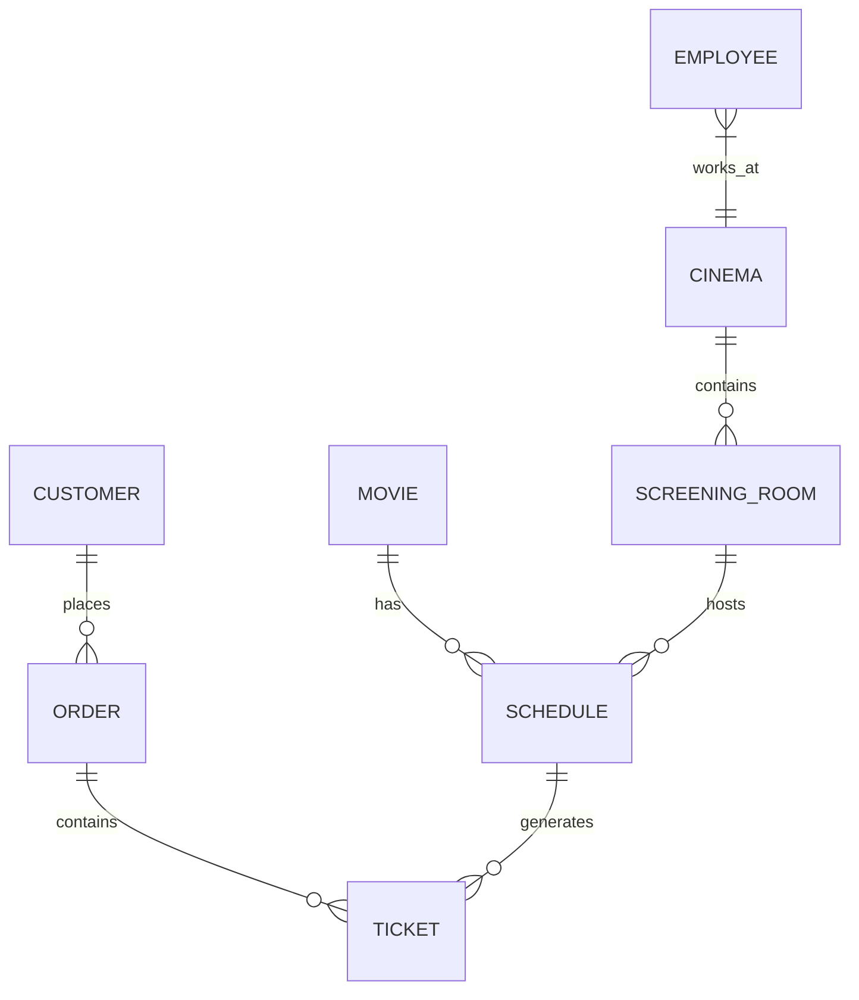

# 系统设计-电影院数据库设计

Created: 2025年2月7日 00:28
Status: 完成

### 一、核心业务实体分析

### 1. 基础维度

| 实体类型 | 说明 | 核心表数量 | 典型字段示例 |
| --- | --- | --- | --- |
| **人员实体** | 员工、顾客 | 2+ | 身份信息、联系方式 |
| **资源实体** | 影院、放映厅、座位 | 3+ | 位置信息、容量信息 |
| **内容实体** | 电影、宣传物料 | 2+ | 元数据、多媒体资源 |
| **交易实体** | 场次、票务、商品订单 | 3+ | 价格、时间戳、状态 |
| **交互实体** | 评价、退改记录 | 2+ | 文本内容、操作日志 |

---

### 二、详细表结构设计

### 1. 人员管理模块

**1.1 员工表 (employee)**

```sql
CREATE TABLE employee (
  employee_id INT AUTO_INCREMENT PRIMARY KEY,  -- 唯一标识
  employee_code VARCHAR(20) UNIQUE NOT NULL,   -- 工号
  full_name VARCHAR(100) NOT NULL,             -- 员工姓名
  password_hash VARCHAR(255) NOT NULL,         -- 使用bcrypt加密
  role ENUM('admin','manager','staff') NOT NULL DEFAULT 'staff',
  phone VARCHAR(20) CHECK (phone REGEXP '^\\\\+?[0-9]{8,15}$'),
  hire_date DATE NOT NULL,                    -- 入职日期
  last_login DATETIME,                        -- 最后登录时间
  INDEX idx_role (role)                       -- 权限查询优化
);

```

**1.2 顾客表 (customer)**

```sql
CREATE TABLE customer (
  customer_id INT AUTO_INCREMENT PRIMARY KEY,
  username VARCHAR(50) UNIQUE NOT NULL,
  password_hash VARCHAR(255) NOT NULL,
  real_name VARCHAR(100) NOT NULL,
  phone VARCHAR(20) CHECK (phone REGEXP '^\\\\+?[0-9]{8,15}$'),
  email VARCHAR(255) CHECK (email REGEXP '^[A-Za-z0-9._%+-]+@[A-Za-z0-9.-]+\\\\.[A-Za-z]{2,}$'),
  registration_time DATETIME DEFAULT CURRENT_TIMESTAMP,
  loyalty_points INT DEFAULT 0,
  INDEX idx_phone (phone(15))                 -- 快速检索
);

```

---

### 2. 影院资源模块

**2.1 影院表 (cinema)**

```sql
CREATE TABLE cinema (
  cinema_id INT AUTO_INCREMENT PRIMARY KEY,
  cinema_name VARCHAR(255) NOT NULL,
  address VARCHAR(500) NOT NULL,
  geo_point POINT SRID 4326,                  -- 地理坐标（支持LBS）
  contact_phone VARCHAR(20) NOT NULL,
  opening_hours JSON,                         -- 存储营业时间JSON对象
  facilities SET('IMAX','4DX','Dolby Atmos')  -- 多选影院设施
);

```

**2.2 放映厅表 (screening_room)**

```sql
CREATE TABLE screening_room (
  room_id INT AUTO_INCREMENT PRIMARY KEY,
  cinema_id INT NOT NULL,
  room_name VARCHAR(50) NOT NULL,
  seat_layout JSON NOT NULL,                  -- 座位矩阵结构存储
  screen_type ENUM('Standard','IMAX','4DX'),
  wheelchair_access BOOLEAN DEFAULT FALSE,
  FOREIGN KEY (cinema_id) REFERENCES cinema(cinema_id) ON DELETE CASCADE
);

```

---

### 3. 电影内容模块

**3.1 电影主表 (movie)**

```sql
CREATE TABLE movie (
  movie_id INT AUTO_INCREMENT PRIMARY KEY,
  title VARCHAR(255) NOT NULL,
  original_title VARCHAR(255),                -- 原版片名
  release_date DATE NOT NULL,
  duration SMALLINT UNSIGNED NOT NULL,        -- 分钟数
  mpaa_rating ENUM('G','PG','PG-13','R','NC-17'),
  director VARCHAR(255),
  cast JSON,                                  -- 主演列表（JSON数组）
  genres JSON,                                -- 类型标签（JSON数组）
  synopsis TEXT,
  poster_url VARCHAR(2048),
  trailer_url VARCHAR(2048),
  fulltext INDEX idx_fulltext (title, synopsis)  -- 全文搜索优化
);

```

---

### 4. 场次管理模块

**4.1 场次表 (schedule)**

```sql
CREATE TABLE schedule (
  schedule_id INT AUTO_INCREMENT PRIMARY KEY,
  movie_id INT NOT NULL,
  room_id INT NOT NULL,
  start_time DATETIME NOT NULL,
  end_time DATETIME GENERATED ALWAYS AS (start_time + INTERVAL (SELECT duration FROM movie WHERE movie_id = schedule.movie_id) MINUTE) STORED,
  base_price DECIMAL(8,2) NOT NULL,
  discount_strategy JSON,                    -- 动态定价策略
  seat_availability JSON NOT NULL,            -- 实时座位状态
  FOREIGN KEY (movie_id) REFERENCES movie(movie_id),
  FOREIGN KEY (room_id) REFERENCES screening_room(room_id),
  INDEX idx_time (start_time)
);

```

---

### 5. 票务交易模块

**5.1 订单主表 (order)**

```sql
CREATE TABLE order (
  order_id CHAR(20) PRIMARY KEY,              -- 订单号（规则:日期+序列）
  customer_id INT NOT NULL,
  order_time DATETIME DEFAULT CURRENT_TIMESTAMP,
  total_amount DECIMAL(10,2) NOT NULL,
  payment_status ENUM('pending','paid','refunded') DEFAULT 'pending',
  payment_method ENUM('wechat','alipay','credit_card'),
  payment_transaction_id VARCHAR(255),
  FOREIGN KEY (customer_id) REFERENCES customer(customer_id)
);

```

**5.2 票务明细表 (ticket)**

```sql
CREATE TABLE ticket (
  ticket_id CHAR(24) PRIMARY KEY,             -- 二维码票据号
  order_id CHAR(20) NOT NULL,
  schedule_id INT NOT NULL,
  seat_row TINYINT UNSIGNED NOT NULL,
  seat_column TINYINT UNSIGNED NOT NULL,
  price DECIMAL(8,2) NOT NULL,
  checkin_time DATETIME,
  ticket_status ENUM('valid','used','expired') DEFAULT 'valid',
  FOREIGN KEY (order_id) REFERENCES order(order_id),
  FOREIGN KEY (schedule_id) REFERENCES schedule(schedule_id),
  UNIQUE KEY uniq_seat (schedule_id, seat_row, seat_column)  -- 防止重复选座
);

```

---

### 三、高级设计要点

### 1. 性能优化策略

- **分区表设计**：对订单表按日期做范围分区（如按季度分区）
- **读写分离**：高频更新表（如票务表）设置主从同步
- **缓存机制**：使用Redis缓存热点数据（如场次余票数）

### 2. 数据完整性保障

```sql
-- 示例：触发器防止超售
DELIMITER $$
CREATE TRIGGER before_ticket_insert
BEFORE INSERT ON ticket
FOR EACH ROW
BEGIN
  DECLARE available BOOLEAN;
  SELECT JSON_EXTRACT(seat_availability, CONCAT('$[', NEW.seat_row-1, '][', NEW.seat_column-1, ']'))
  INTO available FROM schedule WHERE schedule_id = NEW.schedule_id;

  IF NOT available THEN
    SIGNAL SQLSTATE '45000' SET MESSAGE_TEXT = 'Seat not available';
  END IF;
END$$
DELIMITER ;

```

### 3. 扩展性设计

- **版本字段**：所有表包含`version`字段实现乐观锁
- **软删除**：关键表设置`is_deleted`标志位
- **审计字段**：每个表包含`created_at`和`updated_at`时间戳

---

### 四、ER关系模型图



---

### 五、典型查询场景示例

### 1. 场次余票查询

```sql
SELECT
  s.schedule_id,
  m.title,
  s.start_time,
  COUNT(t.ticket_id) AS sold_seats,
  (r.rows * r.columns - COUNT(t.ticket_id)) AS remaining_seats
FROM schedule s
JOIN movie m USING (movie_id)
JOIN screening_room r USING (room_id)
LEFT JOIN ticket t ON s.schedule_id = t.schedule_id AND t.ticket_status = 'valid'
WHERE s.start_time BETWEEN NOW() AND DATE_ADD(NOW(), INTERVAL 7 DAY)
GROUP BY s.schedule_id;

```

### 2. 影院营收统计

```sql
SELECT
  c.cinema_name,
  DATE_FORMAT(o.order_time, '%Y-%m') AS month,
  SUM(o.total_amount) AS total_revenue,
  COUNT(DISTINCT o.customer_id) AS unique_customers
FROM order o
JOIN ticket t USING (order_id)
JOIN schedule s USING (schedule_id)
JOIN screening_room r USING (room_id)
JOIN cinema c USING (cinema_id)
WHERE o.payment_status = 'paid'
GROUP BY c.cinema_id, month WITH ROLLUP;

```

---

该设计满足以下核心需求：

1. **多影院支持**：通过分层结构支持连锁影院管理
2. **动态定价**：JSON字段存储差异化定价策略
3. **实时锁座**：通过座位状态JSON实现并发控制
4. **全渠道接入**：支持在线购票、现场售票等多种业务场景
5. **数据分析**：内置时序统计字段支持BI系统对接

实际部署时需根据业务规模进行分库分表设计，可以使用ShardingSphere等中间件实现水平扩展。